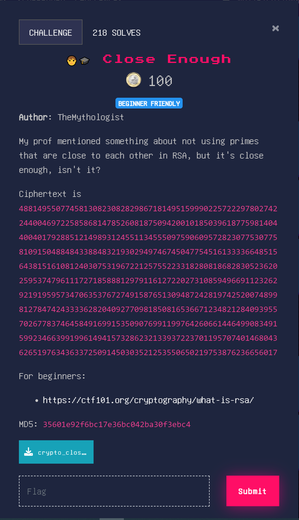

# Close Enough



[Files](./Files/crypto_close_enough.zip)

We are given a cipher text, a public key file, and the python script that generated the two.

This challenge can be quickly solved using [RsaCtfTool](https://github.com/Ganapati/RsaCtfTool). However, it is also simple enough to do by hand (using python).

**Using RsaCtfTool**

```
python3 RsaCtfTool.py --publickey ~/CTF/seeTF/crypto_close_enough/di
strib/key --uncipher "48814955077458130823082829867181495159990225722297802742244004697225858681478526081875094200101850
396187759814044004017928851214989312455113455509759060957282307753077581091504884843388483219302949746745047754516133336
648515643815161081240307531967221257552233182808186828305236202595374796111727185888129791161272202731085949669112326292
191959573470635376727491587651309487242819742520074899812784742433336282040927709818508165366712348212840939557026778374
645849169915350907699119976426066144649908349159923466399199614941573286232133937223701195707401468043626519763436337250
91450303521253550650219753876236656017"
```

```
utf-8 : SEE{i_love_really_secure_algorithms_b5c0b187fe309af0f4d35982fd961d7e}
```

### Review

$n = p \times q$ where $p$ and $q$ are primes and $n$ is the public modulus.
$C = m^e \mod n$ where $C$ is the cipher text, $m$ is the plaintext and $e$ is the public exponent.
We need to find the value $d$ that can reverse this encryption operation. 

$m = C^d$

$d = e^{-1} \mod λ(n)$ where $λ(n)$ is the Carmichael's totient function.
For semi-primes like $n$ it is equivalent to $(p-1) \times (q-1)$.

We know $n$ and $e$ since they are encoded in the public key were given. We are trying to solve for $d$, but in order to do that, we need to find $λ(n)$ which requires finding $p$ and $q$.  Usually factoring $n$ to find $p$ and $q$ is so difficult it is not worth attempting.

### The Vulnerability

Reading the python script the vulnerability becomes clear, the primes are close together. Simple searching around the square root of n should be enough to locate both prime factors. Since the public key has n and e encoded in it we can use pycrypto (actually pycryptodome) to extract $n$. We can then factor it and use it to calculate $λ(n)$ and subsequently $d$.

#### Code

```python
from gmpy2 import *
from Crypto.PublicKey import RSA

public_key = RSA.import_key(open("key").read())
n = mpz(public_key.n)#mpz is a (potentially large) integer

C = mpz(4881495507745813082308282986718149515999022572229780274224400469722585868147852608187509420010185039618775981404400401792885121498931245511345550975906095728230775307758109150488484338848321930294974674504775451613333664851564381516108124030753196722125755223318280818682830523620259537479611172718588812979116127220273108594966911232629219195957347063537672749158765130948724281974252007489981278474243333628204092770981850816536671234821284093955702677837464584916991535090769911997642606614464990834915992346639919961494157328623213393722370119570740146804362651976343633725091450303521253550650219753876236656017)

p = isqrt(n) #floored sqrt
q = f_div(n,p) #floored division
while not (p*q) == n:
    p -=1 
    q = f_div(n,p)

phi = (p-1) * (q-1)
d = pow(public_key.e,-1,phi)#e**-1 % phi
plain = pow(C,d,n)#C**d % n
print(bytes.fromhex(digits(plain,16)))
#b'SEE{i_love_really_secure_algorithms_b5c0b187fe309af0f4d35982fd961d7e}'
```