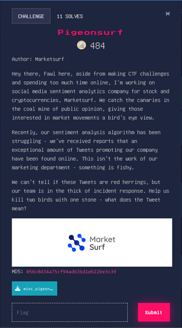
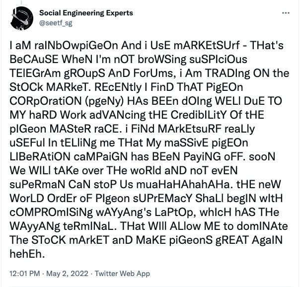

# Pigeonsurf





This challenge was interesting. We are provided with an image of a tweet. The tweet has seemingly random letter casing, with complete disregard for syntax or grammar. It seems clear that the casing encodes some information. My first thought was Morse code however, after comparing the case patterns to Morse code letters I decided this was not likely. It was more likely this was simply binary. I used an OCR to transcribe the image. 

```
Social Engineering Experts

@seetf_sg
I aM raINbOwpiGeOn And i UsE mARKEtSUrf - THat's
BeCAuSE WheN I'm nOT broWSing suSPIciOus
TElEGrAm gROupS AnD ForUms, i Am TRADIng ON the
StOCk MARkeT. REcENtly I FinD ThAT PigEOn
CORpOratiON (pgeNy) HAs BEEn dOIng WELl DuE TO
MY haRD Work adVANcing tHE CredibILitY Of tHE
pIGeon MASteR raCE. i FiNd MArkEtsuRF reaLly
uSEFul In tELliNg me THat My maSSivE pigEOn
LIBeRAtiON caMPaiGN has BEeN PayiNG oFF. sooN
We WILl tAKe over THe woRld aND noT evEN
suPeRmaN CaN stoP Us muaHaHAhahAHa. tHE new
WorLD OrdEr oF PIgeon sUPrEMacY ShaLl begIN wItH
cOMPROmISiNg wAYyAng's LaPtOp, whIcH hAS THe
WAyyANg teRmINaL. THat WIll ALlow ME to domINAte
The SToCK mArkET anD MaKE piGeonS gREAT AgaIN
hehEh.
12:01 PM - May 2, 2022 - Twitter Web App
```

After I fixed its mistakes I began writing a python script to translate the text into a binary string. The uppercase characters are ones and the lower case characters are zeros. Converting the text in this way and ignoring all non-alphabetic characters, I was able to build a binary string that could be converted to an integer and finally convert to bytes.

#### Code

```python
text = """I aM raINbOwpiGeOn And i UsE mARKEtSUrf - THat's
BeCAuSE WheN I'm nOT broWSing suSPIciOus
TElEGrAm gROupS AnD ForUms, i Am TRADIng ON the
StOCk MARkeT. REcENtly I FinD ThAT PigEOn
CORpOratiON (pgeNy) HAs BEEn dOIng WELl DuE TO
MY haRD Work adVANcing tHE CredibILitY Of tHE
pIGeon MASteR raCE. i FiNd MArkEtsuRF reaLly
uSEFul In tELliNg me THat My maSSivE pigEOn
LIBeRAtiON caMPaiGN has BEeN PayiNG oFF. sooN
We WILl tAKe over THe woRld aND noT evEN
suPeRmaN CaN stoP Us muaHaHAhahAHa. tHE neW
WorLD OrdEr oF PIgeon sUPrEMacY ShaLl begIN wItH
cOMPROmISiNg wAYyAng's LaPtOp, whIcH hAS THe
WAyyANg teRmINaL. THat WIll ALlow ME to domINAte
The SToCK mArkET anD MaKE piGeonS gREAT AgaIN
hehEh.
"""

lowercase = [chr(a) for a in range(ord('a'),ord('z')+1)]
uppercase = [c.upper() for c in lowercase]
binarytext = ""
for c in text:
    if c in uppercase:
        binarytext+='1'
    elif c in lowercase:
        binarytext+='0'
num = int(binarytext,2)
print(num)
b = bytes.fromhex(hex(num)[2:]) #i like this better than num.to_bytes(70,'big')
print(b)
#b'SEE{1nf0rm3d_1nv3st1ng_8883695db92227ff6670b2e4ac3986d5}\xa6\x8a\x8a\xf6b\xdc\xcc`\xe4\xdaf\xc8\xbeb'
```