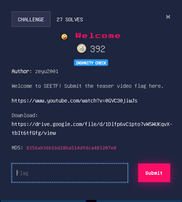
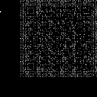
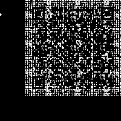
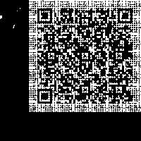

# Welcome

[](./Files/Trailer_With_Challenge.mp4)

This was another fun challenge. Watching the video a few times it quickly become apparent that something weird was going on. Starting at around 26 seconds there are random white dots that seem to move around the top right of the video very quickly. It seems very different than any common steganography methods I've seen. Looking closer I noticed the dots seem to appear very frequently in a square region, so much so that one might begin to draw those borders in their mind just by staring at the dots. 

- White dots on a black background
- Square
- Encoding information

I'm thinking it's some kind of barcode or perhaps a QR code. To figure out for sure we need to extract the positions of all the white dots and begin building a new image, where all those dots appear.

It's generally pretty difficult to work with video files in python so I started by splitting the video into frames with this simple command to ffmpeg.

```
ffmpeg -i Trailer_With_Challenge.mp4 -ss 00:00:26 ./images/output%04d.jpg
```

`-i` indicates input, `-ss` is a starting point hh:mm:ss, `./images/output%04d.jpg` specifies the output location and formatting. 

Once I have all the frames we can use Python Image Library a.k.a. PIL(actually PILLOW) to crop the images to the top right corner.
Next, we can search for the pixels that appear white on the screen. For each white pixel we find, we put a white pixel at the same location in our output image. 

Note: searching for pixels that are exactly (255,255,255) produced sparse images. Instead, I had to search for pixels close to white. I did this by searching for pixels with color values greater than or equal to 255 minus an arbitrary tolerance. Here is a chart of the minimum pixel values and the images they produced.

| (255,255,255)                   | (230,230,230)                    | (200,200,200)                  |
| ------------------------------- | -------------------------------- | ------------------------------ |
|  |  |  |

When scanned the following text appears: `SEE{W3lc0m3_t0_SEETF_95c42d3be1cb93cce8241235529ad96f8e0e1c12}`.

## Code

```python
from PIL import Image

w = 200 #dimension for square
tol = 255-55 #tolerance
new_img = Image.new('RGB', (w, w), (0, 0, 0))#black square
for i in range(1,2928+1):#2928 images
    im = Image.open("./images/output{:0>4}.jpg".format(i))
    im = im.crop((1920-w, 0, 1920, w))#x,y,left,right -> top right corner
    for x in range(w):
        for y in range(w):
            data = im.getpixel((x,y)) 
            if data[0] > tol and data[1] > tol and data[2] > tol:#pixels close to white
                new_img.putpixel((x,y),(255,255,255))

new_img.save("code.jpg")
```