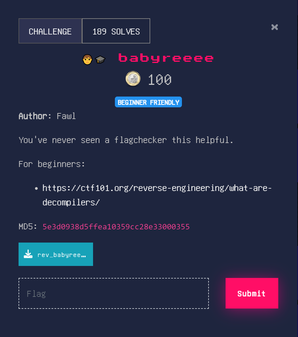

# babyreeee


[Files](./Files/rev_babyreeee.zip)
For this challenge we are given a binary. Running it we are greeted with:
```Hello! Welcome to SEETF. Please enter the flag.```
Entering random characters returns:
```Flag wrong. Try again.```

Simply entering random values I happened to find:

```
aaaaaaaaaaaaaaaaaaaaaaaaaaaaaaaaaaaaaaaaaaaaaaaaaaaa
Good work! Your flag is the correct size.
On to the flag check itself...
Flag check failed at index: 0
```

This tells us the flag is 53 characters long, and that the character at index 0 is incorrect. Replacing the first character with an 'S' produced this:

```
Hello! Welcome to SEETF. Please enter the flag.
Saaaaaaaaaaaaaaaaaaaaaaaaaaaaaaaaaaaaaaaaaaaaaaaaaaa
Good work! Your flag is the correct size.
On to the flag check itself...
Flag check failed at index: 1
```

This tells me the first character is correct. Since the program reports the index in the input where the character doesn't match what is expected, we can write a script to brute force character by character what the flag is.

Here is the code for that, but there is a **better** way!

```python
from pwn import *
import string

def pad(s,l,padc = 'a'):
    while len(s) != l:
        s += padc
    return s

sofar = ""
done = False
while not done:
    try:
        for ch in string.printable:
            p=process("./chall")
            p.sendline(pad(sofar + ch,0x34).encode())
            data = p.recvuntil((b": ",b"Success"))
            if b"Success" in data:
                sofar += ch
                done = True
                break
            else:
                index = int(p.recvall().decode())
                if index > len(sofar):
                    sofar += ch
                    break
            p.close()
    except:
        break
print(sofar)
#"SEE{0n3_5m411_573p_81d215e8b81ae10f1c08168207fba396}"
```

When we open the binary in ghidra we see a lot of variables as well as the important code in main:

```c
  local_d8[0] = 0x98;
  local_d8[1] = 0x8b;
  local_d8[2] = 0x88;
  local_d8[3] = 0xc3;
  local_c8 = 0x71;
  uStack196 = 0xb6;
  uStack192 = 0x7e;
  uStack188 = 0xa3;
  local_b8 = 0x72;
  uStack180 = 0xbb;
  uStack176 = 0x73;
  uStack172 = 0x7d;
  local_a8 = 0x7a;
  uStack164 = 0xa9;
  uStack160 = 0x74;
  uStack156 = 0x73;
  local_98 = 0x68;
  uStack148 = 0xa4;
  uStack144 = 0xb6;
  uStack140 = 0x6e;
  local_88 = 0x62;
  uStack132 = 0xbc;
  uStack128 = 0x61;
  uStack124 = 0x61;
  local_78 = 0x62;
  uStack116 = 0xb3;
  uStack112 = 0x67;
  uStack108 = 0xbc;
  local_68 = 0x61;
  uStack100 = 0x6b;
  uStack96 = 0xb8;
  uStack92 = 0xb5;
  local_58 = 0x56;
  uStack84 = 0x54;
  uStack80 = 0x89;
  uStack76 = 0x55;
  local_48 = 0x8c;
  uStack68 = 0x50;
  uStack64 = 0x5b;
  uStack60 = 0x51;
  local_38 = 0x53;
  uStack52 = 0x54;
  uStack48 = 0x5d;
  uStack44 = 0x5e;
  local_28 = 0x50;
  uStack36 = 0x86;
  uStack32 = 0x89;
  uStack28 = 0x89;
  local_18 = 0x48;
  uStack20 = 0x4f;
  uStack16 = 0x49;
  uStack12 = 0xf1;
  fgets(input,0x80,stdin);
  length = strlen(input);
  if (length == 0x35) {
    puts("Good work! Your flag is the correct size.");
    puts("On to the flag check itself...");
    length = strlen(input);
    i = 0;
    do {
      i_int = i & 0xffffffff;
      if (length - 1 == i) {
        puts("Success! Go get your points, champ.");
        return 0;
      }
      inputChar = input + i;
      expectedChar = expected + i;
      i_byte = (byte)i;
      i = i + 1;
    } while ((byte)*expectedChar == (byte)(*inputChar + 0x45U ^ i_byte));
    printf("Flag check failed at index: %d",i_int);
  }
  else {
    printf("Flag wrong. Try again.");
  }
```

We can see, as we did previously, that we need to input the flag and it will tell us if we are correct. The input is first checked by its length. The expected length is 0x34 (52 in decimal) characters plus an additional null character. If the length is correct it will compare each character to a byte on the stack using the operation `(input[i] + 0x45) ^ i == expected[i]`. If every character is correct it will tell us "Success". Otherwise, it will print the index of the input where the check failed.

The better way to solve this challenge is to simply take each of those variables on the stack and reverse the math. Doing `(expected[i] ^ i) - 0x45` results in the same flag, a lot quicker.

#### Better Way Code

```python
data = [0x98,0x8b,0x88,0xc3,0x71,0xb6,0x7e,0xa3,0x72,0xbb,0x73,0x7d,0x7a,0xa9,0x74,0x73,0x68,0xa4,0xb6,0x6e,0x62,0xbc,0x61,0x61,0x62,0xb3,0x67,0xbc,0x61,0x6b,0xb8,0xb5,0x56,0x54,0x89,0x55,0x8c,0x50,0x5b,0x51,0x53,0x54,0x5d,0x5e,0x50,0x86,0x89,0x89,0x48,0x4f,0x49,0xf1]

for i in range(len(data)):
    print(chr((data[i] ^ i) - 0x45),end='')
#SEE{0n3_5m411_573p_81d215e8b81ae10f1c08168207fba396}
```